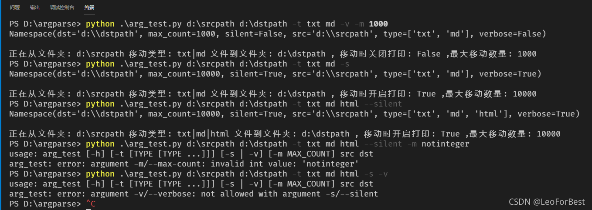
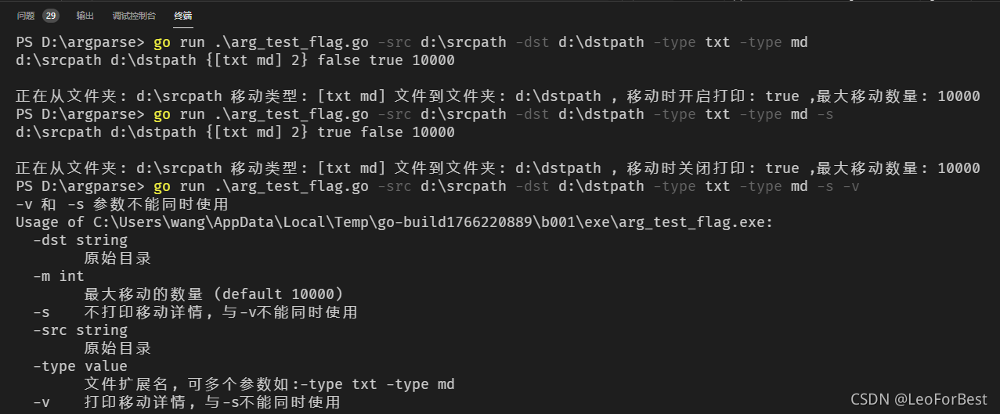

- [Python Go 命令行参数解析  argparse flag](#python-go-命令行参数解析--argparse-flag)
	- [程序参数设计](#程序参数设计)
	- [Python源码和执行结果](#python源码和执行结果)
	- [Golang源码和执行结果](#golang源码和执行结果)
	- [Todo](#todo)
	
# Python Go 命令行参数解析  argparse flag

> 平常需要写一些脚本，经常需要用到参数解析，收集记录下常用用法

## 程序参数设计

> 需求假设，从src目录拷贝指定类型的文件到dst目录, 可静默或打印拷贝, 限制最大拷贝数量

1. `src`和`dst`必须位置参数（`Positional arguments`)
2. `--type`可选参数（`Positional arguments`), 必须（`required=True`）, 可以多个值(`nargs='+'`)
3. 互斥参数`-s`和`-v`
4. 默认指定类型参数`-m`


## Python源码和执行结果



```python
import argparse
parser = argparse.ArgumentParser('arg_test',
                                 description='检索指定目录下面文件并移动到新文件夹')

parser.add_argument('src', help='原始目录')
parser.add_argument('dst', help='目标目录')
# nargs='+' -t 后面至少一个值 nargs='*' -t后面至少0个参数
parser.add_argument('-t', '--type', help='文件扩展名, 如:txt md', nargs='+', required=True)

group = parser.add_mutually_exclusive_group()
group.add_argument('-s', '--silent', help='不打印移动详情', action='store_true', default=False)
group.add_argument('-v', '--verbose', help='打印移动详情', action='store_false', default=True)

parser.add_argument('-m', '--max-count', help='最大移动的数量', type=int, default=10000)

args = parser.parse_args()

print(args, '\n')

if args.verbose:
    print('正在从文件夹: %s 移动类型: %s 文件到文件夹: %s , 移动时开启打印: %s ,最大移动数量: %d' %
          (args.src, '|'.join(args.type), args.dst, args.verbose, args.max_count))
else:
    print('正在从文件夹: %s 移动类型: %s 文件到文件夹: %s , 移动时关闭打印: %s ,最大移动数量: %d' %
          (args.src,  '|'.join(args.type), args.dst, args.verbose, args.max_count))

```

## Golang源码和执行结果



```go
package main

import (
	"flag"
	"fmt"
	"os"
)

type allowTypes struct {
	values []string
	count  int
}

func (t *allowTypes) String() string {
	return fmt.Sprint(t.values)
}

var (
	src      string
	dst      string
	types    allowTypes
	silent   bool
	verbose  bool
	maxCount int
)

func (t *allowTypes) Set(value string) error {
	t.values = append(t.values, value)
	t.count += 1
	return nil
}

func main() {
	flag.StringVar(&src, "src", "", "原始目录")
	flag.StringVar(&dst, "dst", "", "原始目录")
	flag.Var(&types, "type", "文件扩展名, 可多个参数如:-type txt -type md")
	flag.BoolVar(&silent, "s", false, "不打印移动详情, 与-v不能同时使用")
	flag.BoolVar(&verbose, "v", false, "打印移动详情, 与-s不能同时使用")
	flag.IntVar(&maxCount, "m", 10000, "最大移动的数量")
	flag.Parse()

	if src == "" || dst == "" || types.count == 0 {
		flag.Usage()
	} else if silent == false && verbose == false {
		// 默认为-v
		verbose = true
	} else if silent && verbose {
		_, _ = fmt.Fprintln(os.Stderr, "-v 和 -s 参数不能同时使用")
		flag.Usage()
		os.Exit(1)
	}

	fmt.Println(src, dst, types, silent, verbose, maxCount)
	if verbose {
		fmt.Printf("\n正在从文件夹: %s 移动类型: %s 文件到文件夹: %s , 移动时开启打印: %v ,最大移动数量: %d",
			src, types.String(), dst, verbose, maxCount)
	} else {
		fmt.Printf("\n正在从文件夹: %s 移动类型: %s 文件到文件夹: %s , 移动时关闭打印: %v ,最大移动数量: %d",
			src, types.String(), dst, silent, maxCount)
	}
}
```

## Todo

> 第三方golang库和子命令