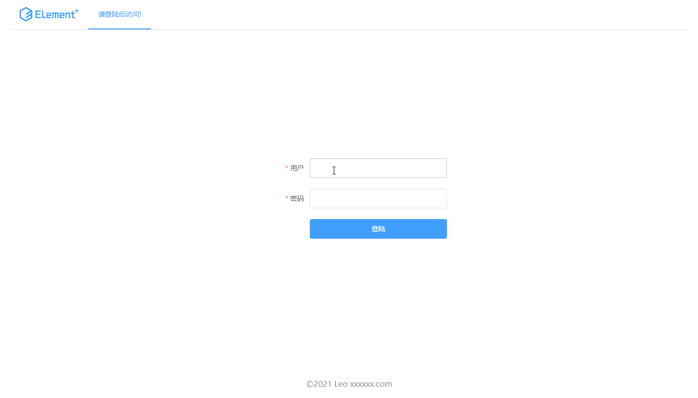

# vue3 element-plus-demo

> 学习以下基本功能

- 登录认证
- 路由功能



## Project setup
```
npm install
```

### Compiles and hot-reloads for development
```
npm run serve
```

### Compiles and minifies for production
```
npm run build
```
